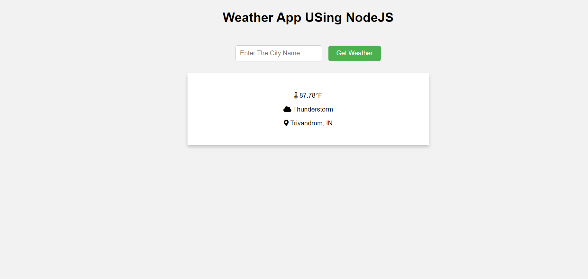

# Weather App using EJS, Node.js, and Express.js

This is a simple weather application built with EJS as the templating engine, Node.js as the server-side runtime, and Express.js as the web framework.

## Preview



## Features

- Get weather information by entering a city name.
- Display temperature, weather conditions, and location details.
- Error handling for invalid city names or API failures.
- Stylish UI with card-based layout.

## Usage

1. Clone the repository:

   ```bash
   git clone https://github.com/KRISHNAKUMARPS2002/Wether_App_EJS-Node-Express.git
